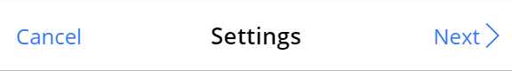
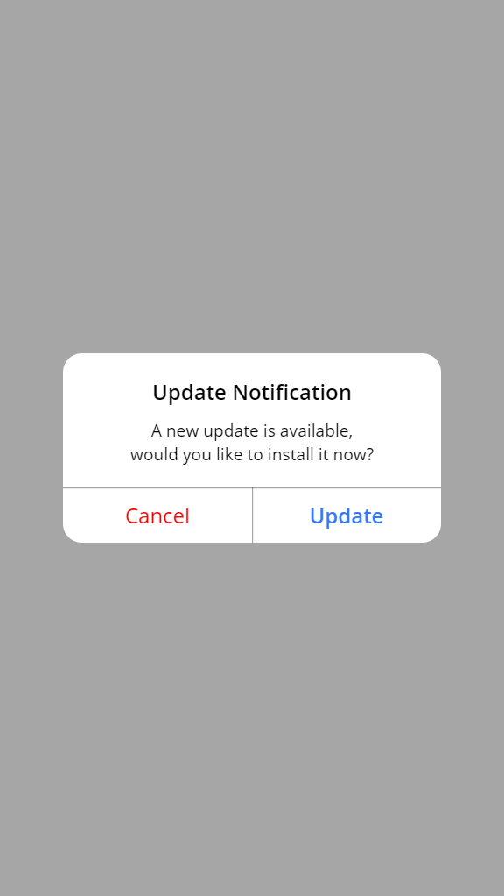

# Universal Components

> Universal Components is a Power Apps component library,   which contains a set of Power Apps common components.

## Overview

### Navigation Bar

| Property Type | Data Type | Name      | Description                          |
| ------------- | --------- | --------- | ------------------------------------ |
| Input         | Text      | Title     | Title of the navigation bar          |
| Input         | Text      | LBText    | Text of the left button              |
| Input         | Screen    | LBNext    | Next screen of the left button       |
| Input         | Boolean   | LBArrow   | Visibility of the left button arrow  |
| Input         | Boolean   | LBVisible | Visibility of the left button        |
| Input         | Text      | RBText    | Text of the right button             |
| Input         | Screen    | RBNext    | Next screen of the right button      |
| Input         | Boolean   | RBArrow   | Visibility of the right button arrow |
| Input         | Boolean   | RBVisible | Visibility of the right button       |

### Popup Notification

| Property Type | Data Type | Name        | Description                                                 |
| ------------- | --------- | ----------- | ----------------------------------------------------------- |
| Input         | Text      | Title       | Title of the popup notification                             |
| Input         | Text      | Description | Description of the popup notification                       |
| Input         | Text      | LBText      | Text of the left button                                     |
| Input         | Color     | LBColor     | Text color of the left button                               |
| Input         | Screen    | LBNext      | Next screen of the left button                              |
| Input         | Boolean   | LBBold      | Font weight of the left button                              |
| Input         | Boolean   | LBHidePN    | Hide the popup notification when selecting the left button  |
| Input         | Text      | RBText      | Text of the right button                                    |
| Input         | Color     | RBColor     | Text color of the right button                              |
| Input         | Screen    | RBNext      | Next screen of the right button                             |
| Input         | Boolean   | RBBold      | Font weight of the right button                             |
| Input         | Boolean   | RBHidePN    | Hide the popup notification when selecting the right button |
| Output        | Boolean   | PNVisible   | Visibility of the popup notification                        |